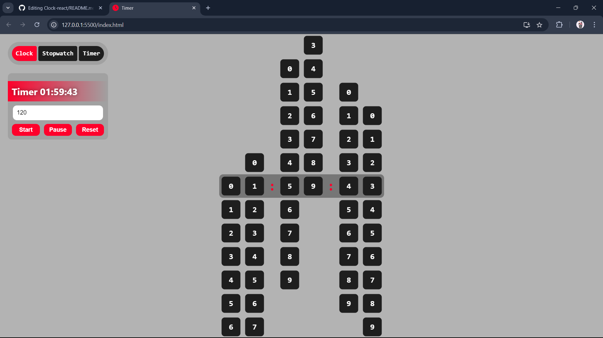

Here’s an example of a **GitHub README** file for your project that includes a clock, stopwatch, and timer functionality. The README provides a detailed overview, instructions for setup, usage, and contributions.

# React Clock, Stopwatch, and Timer

A React-based application that provides a real-time **Clock**, along with **Stopwatch** and **Timer** functionality. The time is displayed in `HH:MM:SS` format, and users can easily switch between the different modes to track or measure time.

## Features

- **Clock**: Displays the current time in `HH:MM:SS` format.
- **Stopwatch**: Measures elapsed time with start, pause, and reset functionality.
- **Timer**: Allows setting a countdown timer, with pause, start, and reset options.

## Screenshots




## Table of Contents

- [Installation](#installation)
- [Usage](#usage)
- [Folder Structure](#folder-structure)
- [Contributing](#contributing)
- [License](#license)

## Installation

To get started with the project, follow these steps:

### Prerequisites

- Make sure you have [Node.js](https://nodejs.org/) and [npm](https://www.npmjs.com/) installed on your machine.

### Setup

1. Clone the repository to your local machine:

   ```bash
   git clone https://github.com/praveenjadhav/Clock-react.git
   ```

2. Navigate into the project directory:

   ```bash
   cd Clock-react
   ```

3. Install the dependencies:

   ```bash
   npm install
   ```

4. Start the development server:

   ```bash
   npm start
   ```

This will open the app in your browser at `http://localhost:3000`.

## Usage

### Clock

- By default, the application displays the real-time **Clock** with hours, minutes, and seconds.

### Stopwatch

- Click the "Stopwatch" button to switch to the stopwatch view.
- Use the **Start**, **Pause**, and **Reset** buttons to control the stopwatch.

### Timer

- Click the "Timer" button to switch to the timer view.
- Enter the countdown time in minutes and click **Start** to begin the timer.
- Use the **Pause** and **Reset** buttons to control the timer.

### Display Format

- All time values (clock, stopwatch, and timer) are displayed in `HH:MM:SS` format using the custom `NoCounter` component, which handles the individual digit display.

## Folder Structure

```plaintext
react-clock-stopwatch-timer/
├── public/
│   ├── favicon.ico
│   ├── index.html
│   └── ...
├── src/
│   ├── components/
│   │   ├── NoCounter.js       # Component that displays time in digits
│   │   └── ...
│   ├── App.js                 # Main component with clock, stopwatch, and timer
│   ├── index.js               # Entry point for React
│   └── ...
├── package.json
└── README.md
```

## Contributing

We welcome contributions to enhance this project! If you have any suggestions or improvements, please follow these steps:

1. Fork the project.
2. Create a new branch with your feature or bug fix: `git checkout -b feature-name`.
3. Commit your changes: `git commit -m 'Add some feature'`.
4. Push to the branch: `git push origin feature-name`.
5. Open a Pull Request.

Please ensure that your code follows the project's coding conventions.

## License

This project is licensed under the MIT License - see the [LICENSE](LICENSE) file for details.
```

### Summary of sections:

- **Features**: Highlights what the application offers (Clock, Stopwatch, Timer).
- **Screenshots**: You can add relevant screenshots here to visually describe the project.
- **Installation**: Steps to clone, install dependencies, and run the project.
- **Usage**: Explains how to use each functionality (Clock, Stopwatch, Timer).
- **Folder Structure**: Gives an overview of the project structure.
- **Contributing**: Instructions for contributing to the project.
- **License**: Includes a link to the license file (replace with your project's actual license).

You can adapt this to include any additional features or project details!
